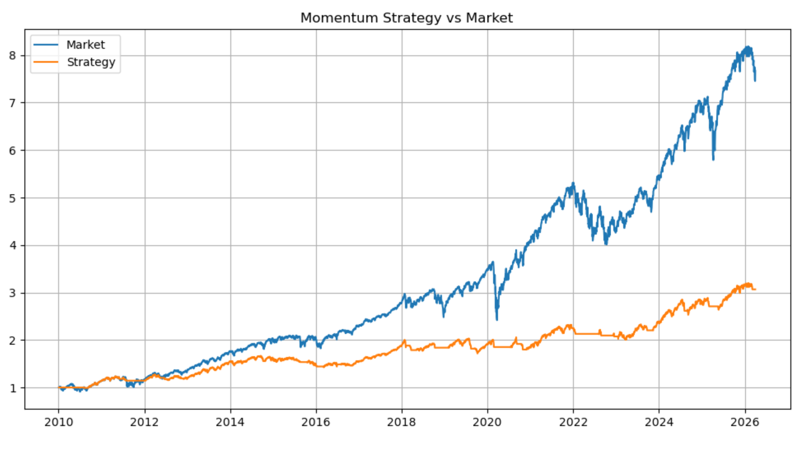

# quant-momentum-strategy-spy
# Quantitative Research Project: Momentum Strategy on SPY

## Overview

This project implements a momentum-based trading strategy on SPY (S&P 500 ETF) using:

- 100-day moving average (trend signal)
- Volatility filtering (risk control)
- Backtesting framework in Python

The goal is to evaluate whether a simple rule-based strategy can improve risk-adjusted returns.

---

## Strategy

### Momentum Rule
- Long when price > 100-day moving average

### Volatility Filter
- No position during high volatility periods

---

## Strategy Performance

---

## Results

| Metric | Strategy |
|------|--------|
| Annual Return | ~7.4% |
| Sharpe Ratio | ~0.75 |
| Max Drawdown | ~-15% |

The strategy produces smoother returns with controlled drawdowns compared to buy-and-hold.

---

## Key Insights

- Momentum is effective in trending markets
- Volatility filtering improves stability
- Simple strategies can achieve reasonable risk-adjusted performance

---

## Limitations

- No transaction costs
- No slippage
- Single asset (SPY)
- Fixed parameters

---

## Technologies Used

- Python
- pandas
- numpy
- matplotlib
- yfinance

---

## Author

Engineering student focused on quantitative research and trading.
